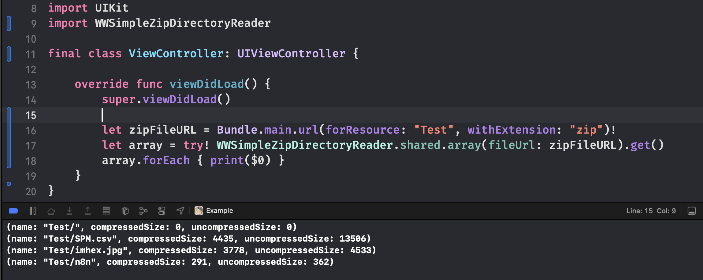

# WWSimpleZipDirectoryReader
[](https://developer.apple.com/swift/) [](https://developer.apple.com/swift/)  [](https://developer.apple.com/swift/) [](https://developer.apple.com/swift/)

### [Introduction - 簡介](https://swiftpackageindex.com/William-Weng)
- [Simply read the directory names of files within a zip archive.](https://developer.apple.com/documentation/foundation/nsorderedset)
- [簡單讀取zip壓縮檔裡的檔案目錄名稱。](https://www.cnblogs.com/muzijie/p/6479342.html)



### [Installation with Swift Package Manager](https://medium.com/彼得潘的-swift-ios-app-開發問題解答集/使用-spm-安裝第三方套件-xcode-11-新功能-2c4ffcf85b4b)
```bash
dependencies: [
    .package(url: "https://github.com/William-Weng/WWSimpleZipDirectoryReader.git", .upToNextMajor(from: "1.0.0"))
]
```

### 可用函式 (Function)
|函式|功能|
|-|-|
|array(fileURL:)|以名稱排序顯示|
|dictionay(fileURL:)|以字典方式顯示|

### Example
```swift
import UIKit
import WWSimpleZipDirectoryReader

final class ViewController: UIViewController {

    override func viewDidLoad() {
        super.viewDidLoad()
        
        let zipFileURL = Bundle.main.url(forResource: "Test", withExtension: "zip")!
        let array = try! WWSimpleZipDirectoryReader.shared.array(fileUrl: zipFileURL).get()
        array.forEach { print($0) }
    }
}
```
